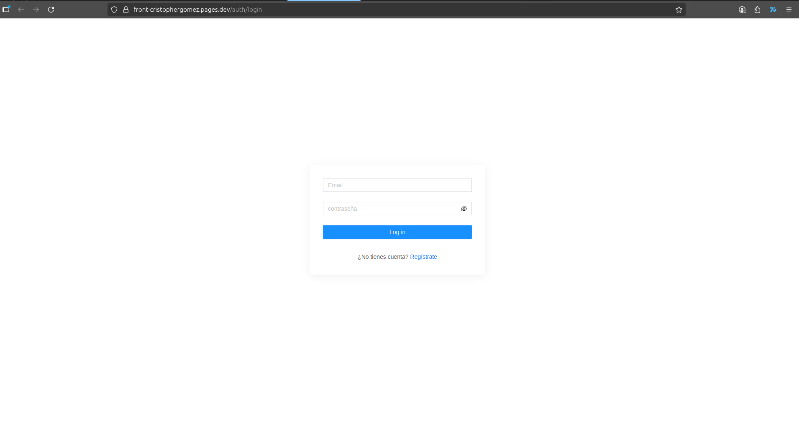

# Frontend Angular - Peluquería

Este proyecto es el frontend de la aplicación de gestión de peluquería, desarrollado en Angular y utilizando pnpm como gestor de paquetes.

---

## Requisitos

- Node.js >= 22.14.0
- Angular CLI

---

## Instalación

1. Clonar el repositorio:

```bash
git clone https://github.com/cristopher-gomez-m/frontend-cristophergomez
cd frontend-cristophergomez

pnpm install

Configuración de variables de entorno

Generar el environment local usando Angular CLI:

ng generate environment environment

Esto creará src/environments/environment.ts.

Editar src/environments/environment.ts:

ng serve

Esto levantará el servidor de desarrollo en http://localhost:4200.

frontend-angular/
├─ src/
│  ├─ app/
│  │  ├─ cliente/
│  │  ├─ atencion/
│  │  ├─ cita/
│  │  └─ shared/
│  ├─ environments/
│  │  ├─ environment.ts          # Generado con ng generate environment
│  │  └─ environment.prod.ts
│  └─ main.ts
├─ angular.json
├─ package.json
└─ pnpm-lock.yaml


Nota

La carpeta src/environments/ está ignorada en Git para no exponer variables sensibles.

Cada desarrollador debe crear su propio environment.ts usando Angular CLI.

```

Pagina web desplegada: https://front-cristophergomez.pages.dev

para ingresar al sistema,se va a registrarse,se crea una cuenta,un email y una contraseña,con esa cuenta creada podrá navegar en el sistema.


